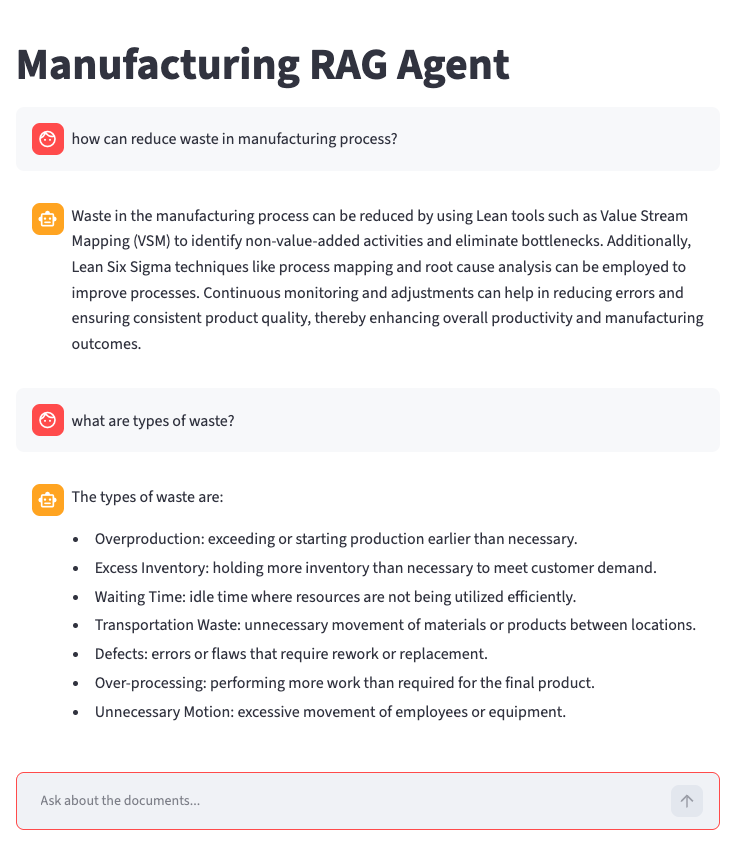

# Manufacturing RAG Agent

A Retrieval-Augmented Generation (RAG) chatbot that answers questions strictly from a collection of manufacturing PDF documents. Ask a question in plain English, and the app retrieves the most relevant passages from your documents and generates an answer grounded only in that content. If the answer is not in the documents, it says so instead of guessing.

## Demo of Rag Agent Screen

Email me for a link to active rag agent. 



## Features

- Document-grounded answers: responses are drawn only from the supplied PDFs, not the model's general knowledge.
- Honest fallback: returns "I don't know" when the answer is not present in the documents.
- Multi-document support: loads and indexes every PDF in the `Docs` folder.
- Semantic search: retrieves by meaning rather than keyword matching, so reworded questions still find the right content.
- Conversational UI: a Streamlit chat interface that retains conversation history within a session.
- Cached index: builds the vector index once and reuses it across interactions for fast responses.

## How it works

The app implements a standard RAG pipeline in two phases.

Indexing (runs once):

1. Load: read text from every PDF in the `Docs` folder.
2. Chunk: split the text into overlapping segments (about 1000 characters with 150 overlap).
3. Embed: convert each chunk into a vector using OpenAI embeddings.
4. Store: save the vectors in a local Chroma vector database.

Querying (runs per question):

1. Retrieve: embed the question and find the most similar chunks (top 5).
2. Augment: insert those chunks into a prompt as context.
3. Generate: ask the LLM to answer using only that context, or to say it does not know.

## Tech stack

- Language: Python 3.12
- Orchestration: LangChain 1.x (LCEL pipe syntax)
- LLM and embeddings: OpenAI (gpt-4o-mini for generation, OpenAI embeddings for retrieval)
- Vector store: Chroma
- PDF parsing: pypdf
- Frontend: Streamlit
- Configuration: python-dotenv

## Project structure

```
ManufacturingRagAgent/
├── Docs/                 # Source PDFs to index (committed so the deployed app can read them)
│   ├── article1.pdf
│   └── article2.pdf
├── 06_app.py             # Streamlit application (entry point)
├── requirements.txt      # Python dependencies
├── .env                  # Local secrets (NOT committed)
├── .gitignore
└── README.md
```

Earlier numbered scripts (`01_load.py` through `05_chain.py`) document the pipeline being built up step by step and are optional to keep.

## Prerequisites

- Python 3.12
- An OpenAI API key with billing enabled (the app makes paid embedding and chat calls)

## Local setup

1. Clone and enter the project:

   ```
   git clone <your-repo-url>
   cd ManufacturingRagAgent
   ```

2. Create and activate a virtual environment:

   ```
   python3 -m venv venv
   source venv/bin/activate
   ```

3. Install dependencies:

   ```
   pip install --upgrade pip
   pip install -r requirements.txt
   ```

4. Add your API key. Create a file named `.env` in the project root:

   ```
   OPENAI_API_KEY=sk-your-key-here
   ```

5. Add PDFs. Place one or more PDF files in the `Docs` folder.

## Running locally

```
streamlit run 06_app.py
```

The app opens in your browser. The first launch builds the vector index (this embeds your PDFs and takes a moment); later questions reuse the cached index and respond quickly.

Note on changing documents or settings: the index is cached on disk in the `chroma_db` folder. If you add or remove PDFs, or change the chunk size or other ingestion settings, delete the `chroma_db` folder so the app rebuilds the index from the current documents. Otherwise it keeps serving answers from the old index.

## Deployment (Streamlit Community Cloud)

1. Push the project to a GitHub repository. Make sure `Docs/` (with PDFs) and `requirements.txt` are committed, and that `.env` and `venv/` are not.
2. Go to Streamlit Community Cloud, choose New app, and point it at your repository, branch, and main file path (`06_app.py`).
3. Add your secret. In the Secrets field, paste:

   ```
   OPENAI_API_KEY = "sk-your-key-here"
   ```

4. Deploy. The build takes a few minutes. After that, pushes to your branch redeploy automatically.

Secrets in code: the app reads the key from Streamlit secrets when deployed and from the `.env` file when run locally, so the same code works in both environments.

## Configuration

Key settings live in `06_app.py`:

- `chunk_size` (default 1000) and `chunk_overlap` (default 150): how documents are split.
- `search_kwargs` `k` (default 5): how many chunks are retrieved per question.
- `model` (default gpt-4o-mini): the generation model.

## Notes and limitations

- Ephemeral storage: on Streamlit Community Cloud the filesystem resets on restart, so the index is rebuilt (and re-embedded) on the first request after each cold start. This is fine for a demo but repeats embedding costs.
- Public access and cost: a deployed app has a public URL by default. Every question spends your OpenAI credits, so set a monthly usage limit on your API key before sharing. Consider a private repository and access controls if needed.
- Document sensitivity: PDFs are committed to the repository and served from a public app. Do not include proprietary or confidential material.
- Extraction quality: tables and multi-column layouts in PDFs can extract imperfectly, which affects answer quality for those sections.

## Possible improvements

- Show source citations (document name and page number) under each answer.
- Persist the index in an external or managed vector store to avoid re-embedding on cold starts.
- Hash ingestion settings and document contents to invalidate the cache automatically when they change.
- Add a rebuild control in the UI.
- Swap the generation model (for example, to Claude) as a comparison experiment.

## License

Add a license of your choice (for example, MIT) if you plan to share this publicly.